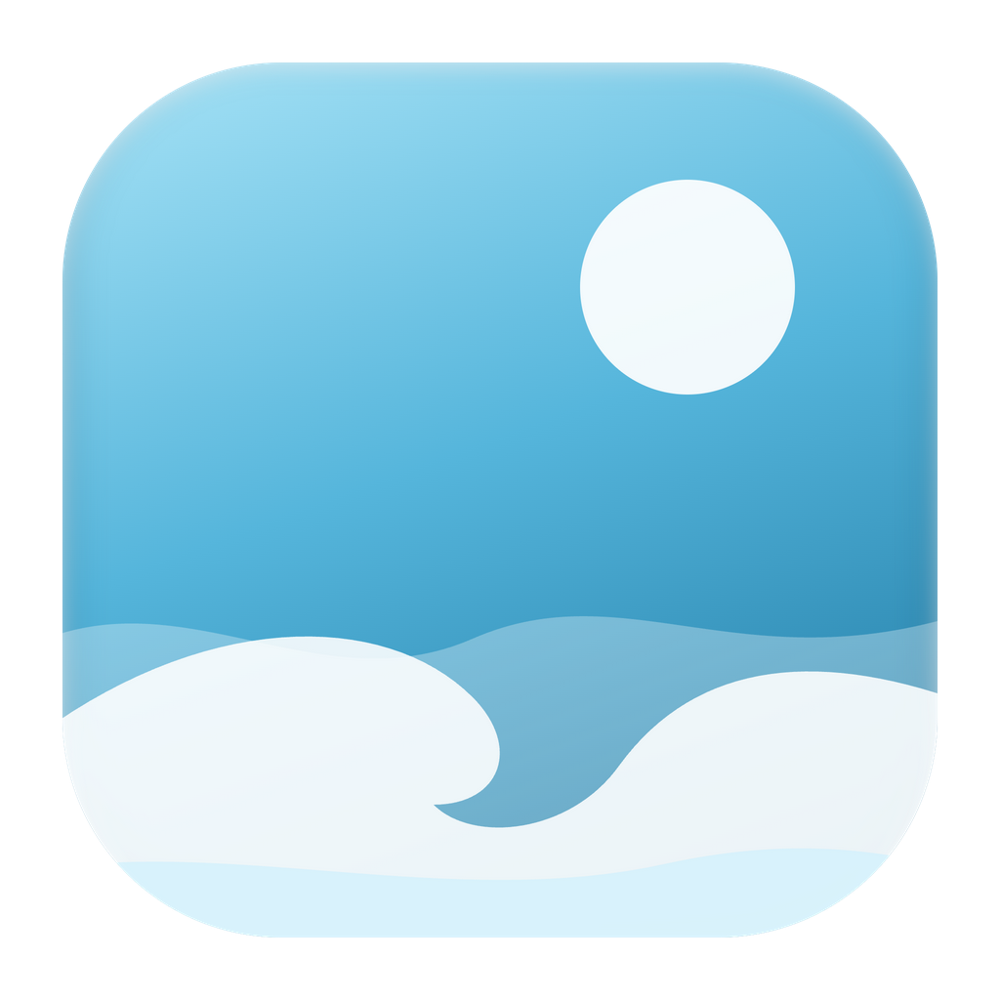

# Offshore 🌊

A calm, human browser. **No AI — just you and the water.**

Offshore is a macOS browser built on the Chromium engine (via Electron) with a fully custom,
liquid-glass, surf-themed shell. It follows the [Helium](https://helium.computer) ethos —
private by default, zero telemetry, no bloat — with the design ambition Helium deliberately
skips.



## Features

- **Real Chromium engine** — same Blink/V8 as Chrome; sites can't tell the difference
- **AI slop detector** — a tiny badge appears when a page reads like machine-generated filler.
  Pure local heuristics (stock phrases, formulaic structure) — no AI involved, nothing leaves
  your Mac. The web as it was meant to be surfed.
- **Page edits** — press ⇧⌘E (or the pencil in the address bar) and reshape any page: click to
  hide an element, rewrite its text in place, or focus the page down to one thing. Edits are
  remembered per site and replayed on every visit — deleted feed modules stay deleted, even when
  the site re-renders them — with undo, a per-site off switch, and a ledger in Settings. No
  extension, no userScripts permission: the browser owns the page, so the editor is built in.
- **Protected content plays** — Widevine DRM via castLabs Electron for Content Security, so
  Netflix, Spotify Web, and friends actually work (dev builds are VMP-signed out of the box)
- **Spaces** — per-window named tab sets with animated switching (⌘⌥←/→), per-space accent
  colors, and optional **separate logins**: give a space its own cookie jar and keep school
  and home accounts signed in side by side. Normal Mac multi-window always works too.
- **Password vault** — a dialog in the middle of the window asks on first login (Save / Not now
  / Never for this site, over a dimmed page), and autofills on return. Encrypted at rest
  (username *and* password) with a macOS-Keychain-backed key via `safeStorage`; exact-origin
  matching, per-profile account memory, Touch ID-gated reveal. Local only, forever.
- **Shield** — built-in uBlock-compatible ad/tracker blocker (EasyList, EasyPrivacy, uBlock
  filters, Peter Lowe's, Fanboy Annoyances), per-site toggle, custom rules, live counter —
  active in every space profile. Allowlist changes apply instantly, no refetch.
- **Popup blocker** — real transient-activation model: popups need a recent click or an
  allowlisted site; blocked ones collect in a chip in the address bar.
- **Bookmarks with folders** — real site favicons in the sidebar tree (the icon captured when
  you saved it, else the site's own `/favicon.ico`, else a letter — never a third-party icon
  service), drag to organize, inline rename, ⌘D popover with folder picker, omnibox search,
  and an optional Chrome-style bookmarks bar in top-bar layout.
- **Light & dark** — full dual theme (System/Light/Dark) across chrome, pages, and onboarding
- **Editorial type** — Newsreader for display moments, Inter for the chrome, bundled locally
- **Dithered waves** — Bayer-dithered pixel surf on the start page, onboarding, and error page
- **Toolbar density** — Classic, Compact, or Dynamic (chrome that tucks itself away)
- **⌘S really hides it** — the sidebar (or top bar) goes, the page takes the room, and the
  setting sticks across relaunches. Push the pointer to that edge and the bar slides back in
  *over* the page for as long as you're using it: the page is never resized, so nothing reflows
  on the way in or out. A page in full screen gets every pixel — no edge will summon it there
- **Weather brief** — a serif good-morning line with live conditions from Open-Meteo. No API
  key, no account, location only if you type one. Zero AI summarization, by principle.
- **One search bar at a time** — a real inline omnibox in the toolbar with type-ahead
  completion, open-tab switching, bookmark results, and quick actions; on a new tab, a search
  panel that springs up in front of the home screen instead. Reach for either and the other
  steps aside. Your own tabs, bookmarks and history are matched locally; the engine's
  finish-my-sentence list is one clearly-labelled toggle in Settings → Privacy (it asks from
  the app itself, no cookies attached, and turning it off means nothing you type leaves the Mac)
- **Site info at a glance** — the tune button in the omnibox opens connection security, Shield
  state with live block count, popup permissions, and a one-click "clear data for this site"
- **Split view** — two tabs side by side in the content area; the toolbar button (or the
  three-dots menu) splits the active tab with its neighbour, and closing either half exits
- **A new tab is the time and the search** — the clock over the waves, with the search bar
  springing up in front of it. Put the search away (click past it, Escape, or the ✕ on the New
  Tab row) and the page stays exactly where it is; the tab goes nowhere. Digits roll softly as
  the clock turns. The widget board — drag-to-place edit mode, the + tray, weather, forecast,
  sunrise/sunset, moon phase — is parked behind `HOME_WIDGETS` in `src/shared/types.ts`: intact,
  switched off, one flag away from coming back
- **Living waves** — both wave styles drift continuously in one direction at layered speeds,
  and the water parts away from your cursor. Closing the last tab lands you here instead of
  closing the window — quitting is an explicit act
- **Toolbar, Helium-style** — copy-link on the address's leading edge (there when the pointer
  is), site info and the star on its trailing edge; extensions, downloads, dev console, and a
  three-dots everything-menu after that. No blocked-request counter sitting in your eyeline —
  the Shield reports in the site panel, where you go to ask
- **Auto mini-player** — playing video pops into a floating PiP window when you switch tabs
- **Vertical sidebar or horizontal top-bar tabs** — toggle with `⌘⇧B`
- **Chrome extensions** — installs straight from the Chrome Web Store (Dark Reader, uBlock
  Origin, etc. — most extensions work)
- **Tiny interface sounds** — synthesized, coastal, very quiet; one toggle away from silence
- **Session restore** — every window, space, tab, and window position comes back
- **Privacy defaults** — history is **off** by default: nothing is written down and the address
  bar never suggests somewhere you've been (turning it on is one toggle in Settings; turning it
  back off forgets what was kept). Geolocation/notification prompts auto-denied, camera/mic asks
  you first, drive-by `file://` pages get zero privileged access, no telemetry, no AI anywhere

## Develop

```bash
npm install
npm run dev        # hot-reloading dev build
npm run typecheck
```

Dev-only test flows (scripted end-to-end checks):

```bash
OFFSHORE_TEST_FLOW=chrome npm run dev      # omnibox type-ahead, new-tab search, ⌘S hide + peek, full screen
OFFSHORE_TEST_FLOW=passwords npm run dev   # save dialog → encrypted vault → autofill → no re-ask
OFFSHORE_TEST_FLOW=popups npm run dev      # drive-by blocked, gestured allowed
OFFSHORE_TEST_FLOW=spaces npm run dev      # cookie isolation, serialization, cross-jar moves
OFFSHORE_TEST_FLOW=headers npm run dev     # client hints on the wire, Google serves real results
OFFSHORE_TEST_FLOW=privacy npm run dev     # history stays off by default, bookmark favicons
OFFSHORE_TEST_FLOW=drm npm run dev         # Widevine CDM present and answering
OFFSHORE_TEST_FLOW=split npm run dev       # split view: geometry, activation, dissolution
OFFSHORE_TEST_FLOW=lasttab npm run dev     # closing the last tab keeps the window
OFFSHORE_TEST_FLOW=slop npm run dev        # slop detector flags filler, spares honest prose
OFFSHORE_TEST_FLOW=pageedits npm run dev   # pick → hide/rewrite, survives re-renders & reloads
```

Each flow writes its `[flowtest]` transcript to `OFFSHORE_TEST_LOG=<file>` as well as stdout —
read the file, since main-process stdout does not survive every launch path. Set
`OFFSHORE_CLEAN_PROFILE=<dir>` to run against a throwaway profile, and
`OFFSHORE_BOOT_LOG=<file>` for a startup trace (plus uncaught-exception capture) when the app
appears to hang before it opens a window.

Flows and screenshots run **quietly**: the harness registers as an accessory app, so its window
paints and captures without ever activating, stealing the keyboard, or bouncing the Dock — you
keep working while it runs. `OFFSHORE_TEST_FOREGROUND=1` restores the old grab-the-focus
behavior for the rare check that needs real OS focus.

The `passwords` and `popups` flows need the renderer dev server, so run those through
`npm run dev`. The rest also work against a production build via
`./node_modules/.bin/electron .`. The `chrome` flow's type-ahead checks need a network
connection; everything else in it is local.

Screenshot harness: `OFFSHORE_SHOT=<dir>` captures the chrome, the page, and a composite of
both. `OFFSHORE_SHOT_URL` navigates first; `OFFSHORE_SHOT_CLICK=<selector>` presses something
and captures what it opened; `OFFSHORE_SHOT_HOVER=<selector>` puts the pointer somewhere and
captures what that alone brings out (the peeking sidebar, the copy-link button);
`OFFSHORE_SHOT_TYPE=<text>` types into the address bar and captures the dropdown.

## Package

```bash
npm run dist       # builds dist/mac-arm64/Offshore.app + .dmg
```

The app is unsigned; on first launch right-click → Open.

Widevine note: the development binaries are VMP-signed by castLabs, so DRM playback works in
`npm run dev` and direct `electron .` runs. A packaged app needs a one-time EVS signup
(`pip install castlabs-evs && python3 -m castlabs_evs.account signup`), then
`python3 -m castlabs_evs.vmp sign-pkg dist/mac-arm64/Offshore.app` after `npm run dist`.

## Roadmap

See [ROADMAP.md](ROADMAP.md) for what's shipped and what's next.
